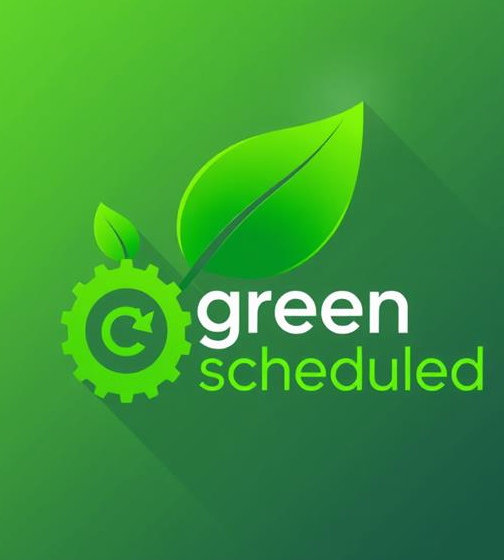
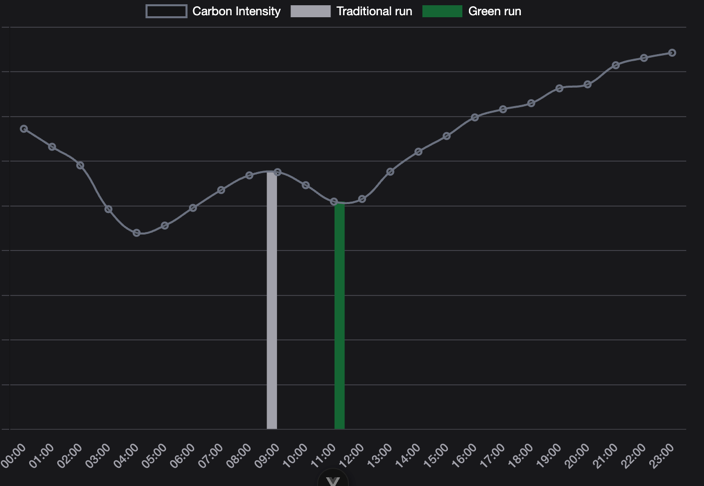
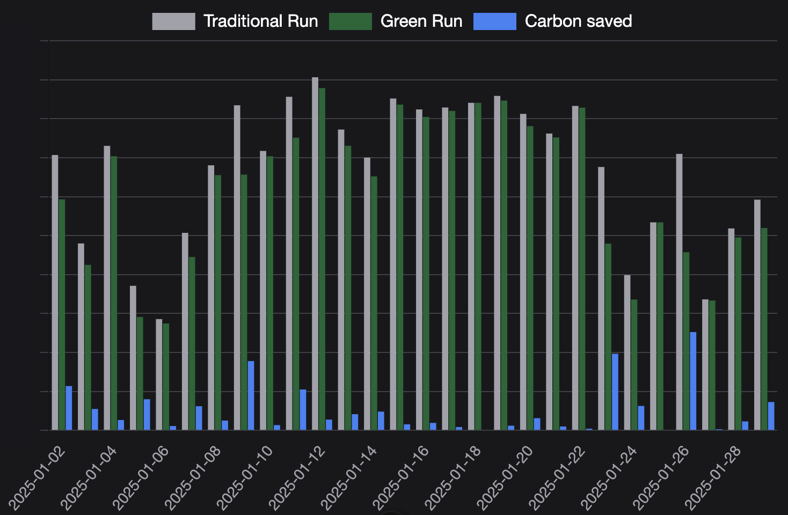

[](https://search.maven.org/artifact/io.carbonintensity/scheduler-bom)
[](https://github.com/carbonintensityio/scheduler/actions?query=workflow%3ABuild)
[](https://github.com/carbonintensityio/scheduler/pulse)
[](https://www.apache.org/licenses/LICENSE-2.0)
[](https://github.com/carbonintensityio/scheduler/stargazers)

# Green scheduling without effort
This open-source job scheduler for Java developers revolutionizes the way you manage your tasks by dynamically assigning jobs to timeslots with greener energy. By effortlessly integrating this scheduler into your software, you can significantly reduce your carbon footprint and contribute to a more sustainable future. Embrace the power of green energy and make your software run greener with ease.

Let's look at an example. We have a job currently running at 9 o'clock that runs roughly an hour. From a business point of view we do not really care when it runs. As long as the job is finished before the end of the working day. So we could schedule it anywhere between 8:00 - 17:00.

The scheduler will calculate when the best (greenest) time is to run the job. For example on the day in the screenshot below, running at 11 o'clock would be more sustainable to run the job. (As the graph shows, there are even better spots outside the window)



Over a month we can see significant reductions in the carbon footprint of this job:


## Current state
This scheduler uses carbon intensity data provided by the carbonintensity.io API — a publicly available service developed by the carbonintensity.io team. Access to the API is free and requires an [API key](#requesting-an-api-key).

The scheduler is tested with Spring, Spring Boot and Quarkus for the NL (Netherlands) carbonIntensityZone. For known issues, planned improvements, and feature requests, please refer to the issues section.

## How to build
The build instructions are available in the [contribution guide](CONTRIBUTING.md).

## Usage
Add the following dependency to the pom for a Spring Boot based project:
```xml
<dependency>
    <groupId>io.carbonintensity</groupId>
    <artifactId>green-scheduler-spring-boot-starter</artifactId>
    <version>0.8.2</version>
</dependency>
```

or the following for a Quarkus-based project:
```xml
   <dependency>
      <groupId>io.carbonintensity</groupId>
      <artifactId>quarkus-green-scheduler</artifactId>
      <version>0.8.2</version>
    </dependency>
```

In the application.yaml add the following config including the [API key](#requesting-an-api-key):

```yaml
green-scheduler:
  api-key: { CARBONINTENSITY_API_KEY }
```

Then apply the `@GreenScheduled` annotation on the to be scheduled method. For an example annotation see the [spring-boot-demo](https://github.com/carbonintensityio/green-scheduling-spring-boot-demo) 

### Schedulers
There are 2 types of schedulers: fixed and successive.

#### Fixed
A scheduler in starting each day in the configured fixed window, where the actual start-time is calculated using the carbon intensity on the set `carbonIntensityZone` and the configured estimated `duration` of the job. Optionally, a `timeZone` can be configured in the annotation to specify in which timezone the start and end-time of the `fixedWindow` are. When no timezone is configured, it will default to the system-default timezone. Note that if the application is redeployed during this window, it might run again.

Using the "regular" scheduler:
```java

@Scheduled(cron = "0 0 9 * * ?", zone = "Europe/Amsterdam")
public void runAt9AM() {
    // Task to be executed at 9 AM every day
}
```

This would be replaced by the `@GreenScheduled` annotation. The job below might start at 8:00, 17:00 or anywhere in between, depending on the carbon intensity calculation. Also see Javadoc of `@GreenScheduled`.
```java

@GreenScheduled(fixedWindow = "08:00 17:00", duration = "1h", carbonIntensityZone = "NL", timeZone = "Europe/Amsterdam")
public void greenFixedWindowJob() {
    // Task to be started at the greenest moment between 08:00 and 17:00
}
```

#### Fixed on a specific day
The green scheduler can also run on a specific day. These days have the same notation as the fields day-of-Month and day-of-Week in a cron expression (Quartz implementation) and can not be used at the same time.  

Using the "regular" scheduler:
```java

@Scheduled(cron = "0 0 9 ? * MON", zone = "Europe/Amsterdam")
public void runAt9AMonMonday() {
    // Task to be executed at 9 AM every monday
}

@Scheduled(cron = "0 0 9 1 * ?", zone = "Europe/Amsterdam")
public void runAt9AMFirstOfMonth() {
    // Task to be executed at 9 AM every first of the month
}

```

Using the green scheduler:
```java

@GreenScheduled(fixedWindow = "08:00 17:00", duration = "1h", carbonIntensityZone = "NL", timeZone = "Europe/Amsterdam", dayOfWeek= "MON")
public void greenFixedWindowJobMonday() {
    // Task to be started at the greenest moment between 08:00 and 17:00
}

@GreenScheduled(fixedWindow = "08:00 17:00", duration = "1h", carbonIntensityZone = "NL", timeZone = "Europe/Amsterdam", dayOfMonth= "1")
public void greenFixedWindowJobFirstMonth() {
    // Task to be started at the greenest moment between 08:00 and 17:00
}
```

#### Successive (experimental)
A scheduler starting at the lowest carbon intensity for the `carbonIntensityZone` within the configured gaps, keeping in mind the `duration` and `carbonIntensityZone` while calculating the optimal starting time of the job.

Using the "regular" scheduler to run a process every 3 hours:
```java

@Scheduled(cron = "0 0 */3 * * ?", zone = "Europe/Amsterdam")
public void runEvery3Hours() {
    // Task to be executed every 3 hours
}
```

Let's replace it by the `@GreenScheduled` annotation. In the example below an initial maximum gap of 3h, the scheduler will find the start-time with the lowest carbon intensity within the first 3 hours of deployment as initial starting point. To have a minimum gap of 1h and max of 4h between each consecutive run. Also see Javadoc of `@GreenScheduled`.

```java
@GreenScheduled(successive = "3h 1h 4h", duration = "PT30M", carbonIntensityZone = "NL")
public void greenSuccessiveWindowJob() {
    // Scheduled job process starting at the greenest moment in the specified window
}
```

### Requesting an API key
Visit the [carbonintensity.io](https://carbonintensity.io) homepage to get an API key for the scheduler.

### Supported zones
The current supported list can be found soon on [carbonintensity.io](https://carbonintensity.io).

### Caveats

#### Concurrent executions
The scheduler may start a process multiple times when multiple instances of the same application are running 
(for example, on different nodes). To prevent this, an additional solution such as 
[Shedlock](https://github.com/lukas-krecan/ShedLock) is needed. 

Shedlock is supported by and tested with `green-scheduler` release v0.8.3 and later, for both Spring Boot and 
Quarkus-based projects. For Spring Boot applications, please note that the deprecated TaskScheduler proxy mode of 
Shedlock is not supported.

Refer to the [ShedLock documentation](https://github.com/lukas-krecan/ShedLock/blob/master/README.md) for more information 
on how to configure and use it with scheduled jobs:
- Instructions for Spring-based application can be found [here](https://github.com/lukas-krecan/ShedLock?tab=readme-ov-file#enable-and-configure-scheduled-locking-spring).
- For Quarkus-based applications, use ShedLock's [CDI integration](https://github.com/lukas-krecan/ShedLock?tab=readme-ov-file#cdi-integration). 

Example of ShedLock's `@SchedulerLock` annotation used together with the `@GreenScheduled` annotation:
```java

@GreenScheduled(fixedWindow = "08:00 17:00", duration = "1h", carbonIntensityZone = "NL", timeZone = "Europe/Amsterdam")
@SchedulerLock(name = "greenFixedWindowJobLock", lockAtMostFor = "5m", lockAtLeastFor = "1m")
public void greenFixedWindowJob() {
    // Task to be started at the greenest moment between 08:00 and 17:00
    // Once started, will be locked for execution by other instances for at least 1 minute and at most 5 minutes.
}
```

## Acknowledgements
The maven project structure and all documentation regarding contribution is adapted from
what the [Quarkus](https://github.com/quarkusio/quarkus) community has created. Further acknowledgements can be found in the [NOTICE](NOTICE) file
